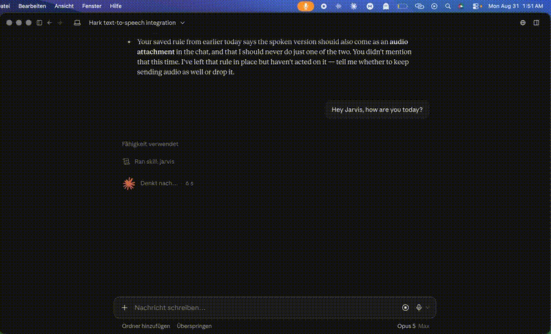

# Hark

**Say a wake word. Keep talking. It types.**



Every dictation app for the Mac makes you press a key first. Hark does not.
You say *"hey hark"*, keep speaking, and your words appear wherever your
cursor is — in any app. Then it presses Return for you.

It reads answers back to you, too. That is the part that makes it a
conversation instead of a keyboard replacement.

Everything runs on your Mac. Nothing goes online unless you switch it on
yourself — and two switches are all there is. **316 KB.**

---

## Why this exists

There are good dictation apps for macOS — `yap`, VoiceInk, OpenWhispr, several
called Sotto. They all work the same way: hold a key, speak, release.

None of them has a wake word. Which means none of them work when your hands
are busy, when you are across the room, or when you are talking to an AI
assistant and want to answer out loud instead of typing.

That is the whole idea.

## What it does

- **Wake word** — set it to anything. *"hey hark"*, *"hey jarvis"*, *"computer"*.
- **Dictation into any app** — types the text, presses Return, never touches
  your clipboard.
- **Reads text aloud** — anything written into a watched file is spoken.
  That is how your AI assistant answers you out loud.
- **Apple voices or Piper** — Piper is neural, offline, and sounds markedly
  better. Hark downloads and installs it for you if you want it.
- **German and English** — interface and recognition. It follows your Mac.
- **Read any selection aloud** — select text anywhere, press ⌥⌘L. Works in
  every app and every browser, with no setup at all.
- **Menu bar only** — no dock icon, no window in your way.

## Install

Download the `.dmg` from [Releases](../../releases), drag Hark to
Applications.

**First launch — macOS blocks it, and the old trick no longer works.**
Double-click Hark once and let macOS refuse. Then open **System Settings →
Privacy & Security**, scroll to the bottom, and click **Open Anyway**. Confirm
once more. That is it — only ever needed the first time.

*(Control-clicking and choosing Open worked until macOS 14. Apple removed that
in Sequoia, so on macOS 15 and later the route above is the only one.)*

Hark is signed, but with a personal Apple ID rather than a paid Developer ID —
so Gatekeeper does not recognise it. This is a cost problem, not a safety one;
the source is right here.

**Or build it yourself and skip that entirely** — see below. An app you
compiled on your own machine was never downloaded, so macOS never quarantines
it and there is no warning at all. Four seconds, no Xcode.

A welcome window then explains the three permissions it needs and why.
Say *"hey hark, this is a test"* into any text field. Done.

## Talking to Claude, out loud

Settings → **Copy the instructions for Claude** puts a ready-made snippet on
your clipboard. Paste it into your chat once. From then on Claude writes a
short spoken version of every answer into Hark's file, and Hark reads it to
you. You speak, it types, Claude answers, you hear it.

Claude needs file access for this — a connected folder in Cowork, or Claude
Code. **If you use Claude in a browser**, that route is closed to you: select
the answer instead and press ⌥⌘L. Same result, no setup.

### More than one chat

Next to the watched file is a `postfach` folder. Drop a text file in there and
Hark reads it out, says which file it came from, and removes it. Files are read
in the order they arrived, and nothing that is already being read gets cut off.

That is the way in for a second assistant, a script, a cron job — anything that
might speak up while something else is still talking. One file per message, so
two writers landing in the same second cannot overwrite each other.

## Build it yourself

No Xcode needed, just the Command Line Tools.

```
git clone <this repo>
cd hark
./build.sh
```

That compiles the Swift sources, builds the icon, writes `Info.plist`, signs
with whatever certificate you have, installs to `/Applications` and produces
a `.dmg`. About four seconds.

This is the cleanest way in. Nothing was downloaded, so Gatekeeper has nothing
to complain about — no right-click, no warning, no flag to strip. And you have
read what you are running, which for something that listens to your microphone
all day is not the worst habit.

There is deliberately no `curl … | bash` one-liner. Such a script would have to
strip macOS's quarantine flag to work, and an app that hears everything you say
is the last thing that should teach you to switch that off.

## Privacy

Nothing leaves your Mac. See [PRIVACY.md](PRIVACY.md) for the specifics —
including how to verify it yourself rather than take my word for it.

## Known limits

- Recognition runs in one language at a time. That is Apple's engine, not a
  design choice.
- Piper needs Python on the machine. Hark points you at Apple's own installer
  if it is missing.
- Not notarised. See Install above.
- Battery draw of continuous recognition is not yet measured.

## Credit

Built by **Darius Bardi**. MIT licensed — do what you like with it, including
selling it. The one thing the licence asks is that my name stays in the
copyright notice. If Hark ends up in something you ship, a mention would be
appreciated.

Voices by [Piper](https://github.com/rhasspy/piper) (MIT) and Apple.

Hark is free and always will be. If it saved you some typing and you feel like
it, there is a [coffee](https://buymeacoffee.com/dariusbardi) — entirely
optional, and nothing in the app is locked behind it.
